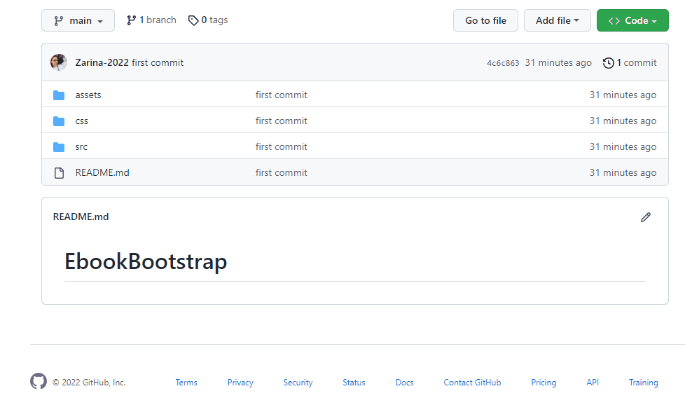

# E-book designed with Bootstrap

<h3>This site was made by using HTML, CSS and JavaScript and <a href="https://www.bootstrapcdn.com/"><b>BOOTSTRAP </b> </a>.</h3>

<h3>Additionally I used <a href="https://cdnjs.com/libraries/font-awesome"><b>Font Awesome</b> </a> (for icons) </h3>

<h3> I used Bootstrap for <b>navbar</b>, <b>card</b>, <b>button</b>,  <b>carousel</b> </h3>

<h3> I used JavaScript for <b>Fixed navbar</b> and for <b> Counter animation</b> </h3>

<h3> I used <a href="https://fonts.google.com/"><b>Google fonts</b></a>: Roboto, Lobster, Poppins(italic)</h3>

<h3>Preview:</h3>

<h2> How to install and run the project. </h2>

Do share your valuable opinions, I appreciate your honest  

Enjoy Coding ❤

